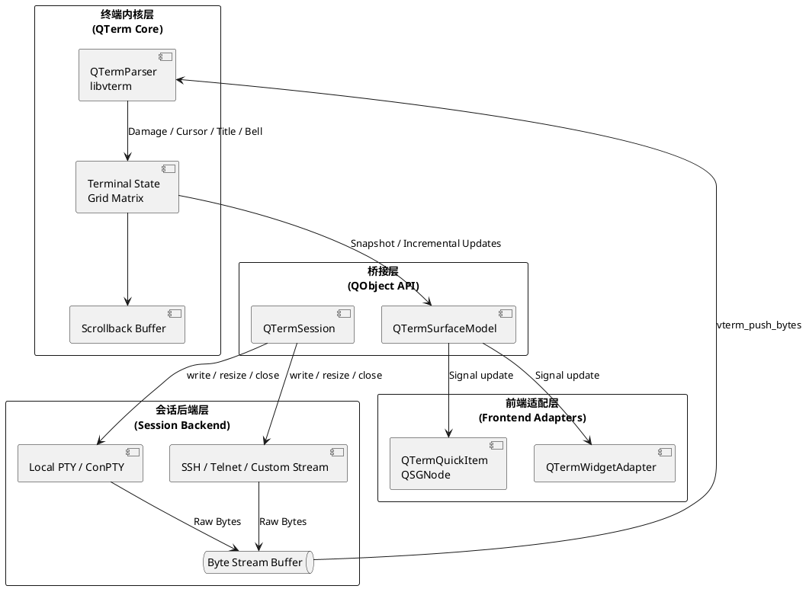

# QTerm 设计文档

## 1. 核心愿景
**QTerm** 是一个基于 **Qt** 与 **libvterm** 构建的高性能、跨平台终端模拟器组件库。它的目标不是重新发明一套 I/O 运行时，而是聚焦在终端状态建模、增量渲染和前端控件抽象上，为 **QML / Qt Quick** 提供比传统 QWidget 方案更流畅的终端体验，同时保留对 QWidget 的接口兼容能力。

## 2. 系统架构 (Architecture)

QTerm 采用“终端内核 + 会话后端 + 前端适配层”的分层架构。终端协议解析与状态维护是核心；本地终端、远程终端只是字节流来源；QQuickItem 和 QWidget 只是不同的展示壳层。

### 2.1 架构图 (PlantUML)



---

## 3. 模块设计

### 3.0 源码目录布局
当前源码结构按职责拆分如下：
* `src/core`: 终端状态、parser 对接、surface model、scrollback、damage 合并。
* `src/session`: 会话抽象和通用 glue code。
* `src/session/local`: 本地终端后端。
* `src/session/remote`: 远程终端后端，后续用于 SSH / Telnet 等实现。
* `src/platform`: 平台差异较重时承接平台专属辅助实现。
* `src/quick`: Qt Quick 前端控件实现。

当前第一阶段会优先在 `src/session/local` 中提供基于 Unix PTY 的本地 backend，实现 shell 启动、原始字节流读取、窗口尺寸同步和会话关闭。
在 libvterm 完整接入前，可以使用一个临时文本表面适配层把 `readyRead()` 数据转成可见 cell 网格，用于尽早验证 session、surface model 和 Qt Quick 渲染链路。
为避免后续大面积重构，`src/core` 已开始拆出独立 parser 抽象；临时文本 parser 与未来的 libvterm parser 都通过同一套入口消费字节流并更新 surface model。
当前仓库已将 `libvterm` 以 vendored third-party 方式放入 `third_party/libvterm`，并通过本地 CMake 包装纳入构建。

### 3.1 会话后端抽象 (`QTermSessionBackend`)
QTerm 不把某一种 I/O 框架写死为核心依赖，而是抽象统一的会话后端接口：
* **本地终端**: Unix 平台基于 PTY，Windows 平台基于 ConPTY。
* **远程终端**: 基于 SSH、Telnet 或任意可读写字节流。
* **统一职责**: 启动 / 连接、写入、窗口尺寸同步、关闭、上报原始字节流和退出事件。

这样做的目标是把“终端模拟”与“连接方式”解耦，减少核心库依赖，并允许后续按平台选择最合适的底层实现。

### 3.2 线程模型：内核与 UI 解耦
* **会话线程**: 负责本地 PTY 或远程连接的 I/O。
* **内核更新阶段**: 将原始字节流送入 libvterm，生成屏幕状态变更。
* **Qt UI 线程**: 负责信号槽派发、输入事件处理和渲染。
* **同步机制**: 后端只投递字节流和状态事件，不直接操作 UI 对象。

线程模型的关键约束是：终端状态更新和渲染更新之间必须存在清晰的增量边界，避免因为大批量输出导致 UI 线程做全量刷新。

### 3.3 前端抽象：QQuickItem 优先，QWidget 可接入
QTerm 的首要目标前端是 Qt Quick，但顶层控件接口必须独立于具体视图技术：
* **QTermSurfaceModel**: 提供可见区域快照、脏区、光标、选择区和样式信息。
* **QTermQuickItem**: 基于 QSGNode 做高性能渲染，是主要实现路径。
* **QTermWidgetAdapter**: 基于同一套模型消费更新事件，为 QWidget 提供兼容接入层。

这样可以保证核心终端能力只实现一次，而不同 UI 技术栈共享同一套状态模型和交互接口。

### 3.4 滚动与 Resize 是一级能力
滚动和 resize 不属于后期优化项，而是终端控件的基础能力，必须在模型层和前端层同时建模：
* **滚动语义归模型所有**: `QTermSurfaceModel` 需要维护 viewport、scrollback 位置、follow output 状态和像素级内容偏移。
* **丝滑滚动归前端实现**: `QTermQuickItem` 负责处理滚轮、触控板和像素滚动输入，并将其转换成按行滚动和局部重绘。
* **resize 贯穿全链路**: 控件尺寸变化必须同步更新可见列行数，并把新的 terminal size 传递到 session backend 和终端内核。
* **避免全量重建**: 大量输出、快速滚动和频繁 resize 时，渲染更新都应以脏区和视口增量为基本策略。

---

## 4. 关键接口与数据结构 (C++ Spec)

### 4.1 会话抽象类
```cpp
class QTermSession : public QObject {
    Q_OBJECT
public:
    // 启动本地会话或建立远程会话
    bool start();
    qint64 bytesAvailable() const;
    QByteArray read(qint64 maxSize);
    QByteArray readAll();
    void write(const QByteArray &data);
    void resize(int cols, int rows);
    void close();

signals:
    void readyRead();
    void sessionExited(int exitCode);
    void titleChanged(const QString &title);
    void bellTriggered();

private:
    std::unique_ptr<QTermSessionBackend> m_backend;
};
```

### 4.2 渲染单元格 (`QTermCell`)
保持紧凑的内存布局，便于批量上传 GPU。
```cpp
struct QTermCell {
    uint32_t code;      // Unicode 码点
    uint32_t fg;        // 前景色 (ARGB)
    uint32_t bg;        // 背景色 (ARGB)
    uint16_t attr;      // 样式 (加粗、反色、闪烁等)
    uint8_t  width;     // 字符宽度 (1 或 2)
};
```

### 4.3 前端共享模型
```cpp
class QTermSurfaceModel : public QObject {
    Q_OBJECT
public:
    QSize terminalSize() const;
    QRect dirtyRegion() const;
    int viewportTopLine() const;
    bool followOutput() const;
    const QTermCell *visibleCells() const;

    void scrollByLines(int deltaLines);
    void scrollToBottom();

signals:
    void contentChanged();
    void cursorChanged();
    void selectionChanged();
    void viewportTopLineChanged();
    void followOutputChanged();
};
```

### 4.3.1 会话读取语义
`QTermSessionBackend` 采用接近 `QIODevice` 的设计：
1. 通过 `readyRead()` 只做数据可读通知。
2. 通过 `read()` / `readAll()` 主动拉取后端缓冲中的字节。
3. 通过 `bytesAvailable()` 查询当前可读字节数。

这样可以降低早期设计对信号参数传递的耦合，也更容易在后续切换到聚合缓冲、跨线程队列或批量解析策略。

### 4.3.2 Parser 抽象
`QTermParser` 是终端解析层的稳定接入点：
1. `QTermSession` 通过 `readyRead()` 和 `readAll()` 提供原始字节流。
2. `QTermParser` 负责消费字节流，并把解析结果写回 `QTermSurfaceModel`。
3. 早期可使用简化文本 parser 验证链路，后续替换为 libvterm parser 时不改变 session 和前端接口。
4. 默认 parser 可以直接切换为 `QTermLibvtermParser`，以尽早验证真实 VT 解析路径。

### 4.4 QQuickItem 视口接口
```cpp
class QTermQuickItem : public QQuickItem {
    Q_OBJECT
public:
    QSizeF cellSize() const;
    void setCellSize(const QSizeF &size);

    QTermSession *session() const;
    void setSession(QTermSession *session);

protected:
    void geometryChange(const QRectF &newGeometry, const QRectF &oldGeometry) override;
    void wheelEvent(QWheelEvent *event) override;
};
```

---

## 5. 渲染引擎设计 (QML 版)

### 5.1 动态字形图集 (Dynamic Glyph Atlas)
为了支持中英文混排及 Emoji：
1.  **缓存查询**: 渲染层收到 `damage` 信号，遍历单元格。如果字符不在图集中，则在内存中绘制该字符位图。
2.  **图集更新**: 使用 `glTexSubImage2D` 将新字形上传到大纹理。
3.  **绘制**: 使用 `QSGGeometryNode` 提交所有可见单元格的顶点（4个顶点构成一个四边形，UV 指向图集位置）。

### 5.2 增量更新原则
为了避免在大批量输出时出现卡顿，渲染层必须遵守以下原则：
1.  **以脏区驱动**: 只更新受影响的行或区域，不做全量重建。
2.  **滚动优先复用**: 滚屏时优先移动已有几何数据，只补绘新进入可视区的内容。
3.  **状态与视图分离**: 光标、选择区、输入法预编辑内容应作为独立叠加层处理。
4.  **跨前端一致性**: QQuickItem 与 QWidget 适配层消费同一套脏区和快照协议。

### 5.3 Resize 与滚动验收标准
第一阶段实现至少应满足以下条件：
1.  **滚动连续性**: 鼠标滚轮和触控板滚动不会导致整屏闪烁或明显抖动。
2.  **滚动一致性**: scrollback 位置、光标状态和视口内容始终一致。
3.  **底部跟随**: 新输出到来时支持自动 follow bottom；用户上翻后不会被强制拉回到底部。
4.  **尺寸同步**: 控件几何尺寸变化后，列数和行数会稳定同步到 session backend。
5.  **局部更新**: 快速 resize 时优先采用增量策略，避免每一帧全量重建几何数据。

---

## 6. 技术栈依赖

1.  **Qt 6.8**: 当前开发版本基线，提供 Core、Gui、Quick 等基础能力。
2.  **libvterm**: 负责 VT100/XTerm 协议解析。
3.  **平台原生 PTY / ConPTY**: 用于本地终端后端实现。
4.  **Qt Network 或其他远程协议库 (可选)**: 用于 SSH / Telnet 等远程终端接入。
5.  **KDE KPty (可选参考)**: 在 Unix 平台上辅助处理 PTY 细节。

---

## 7. 库的优势

* **依赖更克制**: 聚焦终端模拟核心，不把通用事件循环库引入为基础依赖。
* **前后端解耦**: 本地终端、远程终端和 UI 技术栈都通过抽象层隔离。
* **QML 优先**: Qt Quick 版本直接操作 Scene Graph，优先追求高帧率和低卡顿。
* **兼容 QWidget**: QWidget 不是主路径，但可通过共享模型和适配层接入。

---

## 8. 下一步开发计划 (Roadmap)

1.  **[Core]** 编写 CMake 脚本，完成 Qt 6.8 与 libvterm 依赖集成。
2.  **[Core]** 定义 `QTermSession`、`QTermSessionBackend` 和 `QTermSurfaceModel` 的接口边界。
3.  **[Local]** 在 macOS 下跑通基于 PTY 的本地 `zsh` 会话读写与 resize。
4.  **[Logic]** 将 `libvterm` 的 damage、cursor、scroll 事件转成统一的增量更新协议。
5.  **[UI]** 编写第一个基于 `QSGGeometryNode` 的 `QTermQuickItem`。
6.  **[Compat]** 在共享模型上验证 QWidget 适配层的可行性。

---