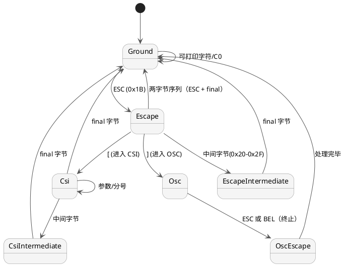

# 核心层：QTermCore 与状态管理

本文深入讨论 QTerm 的语义核心——`QTermCore`、`QTermBuffer`、`QTermTextParser`
和 `QTermInputExecutor` 如何协作将原始字节转化为屏幕状态。

---

## 整体架构

```
字节输入
  ↓
QTermTextParser（状态机）
  ↓ 解析事件回调
QTermInputExecutor（命令执行）
  ↓ 修改状态
QTermScreenState（屏幕状态）
  ↓
QTermBuffer（内容存储）
  ↓
QTermCore::sizeChanged / debugPlainTextChanged（信号）
```

### 三个核心对象

| 类 | 职责 | 状态 |
|-----|------|------|
| `QTermTextParser` | ECMA-48 VT 状态机 | 有状态（状态机状态 m_state） |
| `QTermInputExecutor` | 解析事件→屏幕命令 | 无状态（操作 ScreenState） |
| `QTermCore` | 对外界面、信号发出 | 持有 ScreenState 和 ModeState |

---

## QTermTextParser：VT 状态机

ECMA-48 定义的终端协议是一个有限状态自动机。QTermTextParser 实现了七个状态：



### 七个状态详解

| 状态 | 触发条件 | 示例 | 输出事件 |
|------|---------|------|---------|
| `Ground` | 初始态或完成一个序列后 | `"hello"` | `executor.print("hello")` |
| `Escape` | 收到 ESC (0x1B) | `"\e7"` (DECSC) | 根据后续字符决定 |
| `EscapeIntermediate` | ESC 后跟中间字节 | `"\e(0"` | 字符集切换 |
| `Csi` | ESC [ 或 0x9B | `"\e[5;10H"` | 参数积累 |
| `CsiIntermediate` | CSI 中出现中间字节 | `"\e[3 J"` | 参数 + 中间字节 |
| `Osc` | ESC ] 或 0x9D | `"\e]2;Title\a"` | 数据积累至 BEL/ST |
| `OscEscape` | OSC 数据中遇到 ESC | — | 等待 \ 或 BEL |

### 关键设计

**参数状态跨 write() 调用保持：**  
VT 序列常常被分段到达（例如网络延迟或缓冲区限制）。

```cpp
// 错误的做法：每个 write() 调用重置解析器状态
void QTermCore::write(const QByteArray &data) {
    m_parser.reset();  // ❌ 丢失残缺序列的中间状态
}

// 正确的做法：保持状态跨调用
void QTermCore::write(const QByteArray &data) {
    m_parser.parse(data, executor);  // ✅ m_state 保持
}
```

---

## QTermBuffer：内容模型

`QTermBuffer` 将所有终端内容分为两部分：

### 内存布局

```
┌──────────────────────┐
│  m_historyLines[]    │  ← 已滚出视口的历史行（动态增长）
│  [0]  oldest         │
│  [1]                 │
│  ...                 │
│  [N]  most recent    │
└──────────────────────┘
         ↑
    scrollUp() 在这里追加
         ↓
┌──────────────────────┐
│  m_visibleLines[]    │  ← 恰好 rows 行，当前视口
│  [0]                 │
│  [1]                 │
│  ...                 │
│  [rows-1]           │
└──────────────────────┘
```

### 逻辑行链接

每个 `QTermLine` 有一个 `wrappedToNextLine` 标志。当光标超越行尾且自动换行开启时，
该标志被设为 `true`，光标移到下一行开头。这样相邻行被链接成*逻辑行*：

```
物理行 0: "Hello world " (wrappedToNextLine=true)
物理行 1: "this is a long " (wrappedToNextLine=true)
物理行 2: "message"       (wrappedToNextLine=false)
           ↑ 逻辑行停止

-> 逻辑行文本为："Hello world this is a long message"
```

### Resize 重排（Reflow）

当终端宽度改变时，`QTermBuffer::resize()` 必须重新计算所有逻辑行在新宽度下的物理行分布：

```
原宽度 80 列：
逻辑行：Hello world this is a long message
物理行：
[0] "Hello world this is a long " (wrap)
[1] "message"

新宽度 40 列后：
[0] "Hello world this is a long " (wrap)
[1] "message"  ← 同样，因为原本 wrap 后就只有 message，正好不超过 40 列

新宽度 20 列后：
[0] "Hello world this " (wrap)
[1] "is a long " (wrap)
[2] "message"
```

reflow 算法复杂度 O(总字符数)，但只在 resize 时执行一次。

---

## QTermInputExecutor：命令执行

`QTermInputExecutor` 是*无状态的*。它接收解析事件并修改 `QTermScreenState`：

```cpp
class QTermInputExecutor {
    // 输入端（由 Parser 调用）
    void print(const QString &text);
    void cursorUp(int count);
    void characterAttributes(const QVector<int> &params);
    void setScrollRegion(int top, int bottom);
    // …

    // 输出端（通过处理器回调）
    void setBellHandler(const std::function<void()> &handler);
    void setOutboundHandler(const std::function<void(const QByteArray &)> &handler);
    void setRegisterHyperlinkHandler(const std::function<int(const QString &)> &handler);
    // …

private:
    QTermScreenState &m_currentScreen;  // 指向主屏或备屏
    QTermModeState &m_modeState;
    // 处理器函数指针（由 Core 设置）
    std::function<void()> m_bellHandler;
    std::function<void(const QByteArray &)> m_outboundHandler;
    // …
};
```

### VT 序列处理示例

#### CSI m：SGR（选择图形再现模式）

```
CSI 1 ; 31 ; 44 m  →  粗体 + 前景红 + 背景蓝

解析器调用：executor.characterAttributes({1, 31, 44})

执行器遍历参数：
  1   → 粗体：currentAttributes.bold = true
  31  → 前景色（index 1 = 红）：currentAttributes.foregroundColorIndex = 1
  44  → 背景色（index 4 = 蓝）：currentAttributes.backgroundColorIndex = 4

后续的 print() 调用会使用这些属性写入单元格。
```

#### CSI H：CUP（光标位置）

```
CSI 5 ; 10 H  →  移动到第 5 行第 10 列

解析器调用：executor.cursorPosition(5, 10)
执行器：cursorState.row = 4; cursorState.column = 9;  // 0-indexed
```

#### CSI ? 1049 h：DECSWL（切换备用屏幕）

```
CSI ? 1049 h  →  切换到备用屏幕

解析器调用：executor.setPrivateModes({1049}, enabled=true)
执行器：
  enterAlternateScreen(saveCursor=true, clearScreen=true);
  m_currentScreen = &m_alternateScreen;
  m_alternateScreen.clear();
```

---

## OSC 8：超链接处理

OSC 8 定义格式：`OSC 8 ; params ; URL ST text OSC 8 ; ; ST`

```
\e]8;id=123;https://example.com\eClickable text\e]8;;\e
      ↑                          ↑  hyperlink content  ↑ close
    open                                            close (empty URL)
```

### 注册流程

1. **Parser 遇到 `OSC 8 ; id=123 ; https://example.com`：**  
   调用 `executor.setHyperlink("https://example.com")`

2. **Executor 记录 hyperlink：**  
   ```cpp
   void setHyperlink(const QString &url) {
       if (url.isEmpty()) {
           currentAttributes.hyperlinkId = 0;  // 关闭链接
       } else {
           int id = m_registerHyperlinkHandler(url);  // Core 分配 ID
           currentAttributes.hyperlinkId = id;         // 后续写入的字符带上该 ID
       }
   }
   ```

3. **Core 中的处理器：**  
   ```cpp
   void QTermCore::setupExecutor() {
       executor.setRegisterHyperlinkHandler([this](const QString &url) {
           return registerHyperlinkUrl(url);
       });
   }

   int QTermCore::registerHyperlinkUrl(const QString &url) {
       int id = m_nextHyperlinkId++;
       m_hyperlinkUrls[id] = url;
       return id;
   }
   ```

4. **Surface 层查询 URL：**  
   ```cpp
   // QTermTerminal::hyperlinkUrl(id)
   QString QTermTerminal::hyperlinkUrl(int id) const {
       return core->hyperlinkUrl(id);  // 查询注册表
   }
   ```

---

## 完整数据流示例

```
用户在 shell 中输入：printf '\e[31mRed text\e[m'

1. 字节到达 QTermSession
   dataReceived("\e[31mRed text\e[m")

2. QTermTerminal 解码 UTF-8 并调用 Core
   QTermCore::writePlainText("\e[31mRed text\e[m")

3. Parser 处理：
   "\e["      → 进入 CSI 状态
   "31"       → 参数积累
   "m"        → CSI final，调用 executor.characterAttributes({31})
   "Red text" → Ground 状态，调用 executor.print("Red text")
   "\e["      → CSI 再次
   "m"        → final（0 参数默认=重置），调用 executor.characterAttributes({0})

4. Executor 执行：
   characterAttributes({31}) → currentAttributes.foregroundColorIndex = 1 (红)
   print("Red text") → 逐字写入缓冲区，每个字符带 currentAttributes
   characterAttributes({0}) → currentAttributes 重置为默认

5. Core 发出信号
   debugPlainTextChanged() → 触发 Surface 刷新
   → 前端重绘 "Red text" 为红色
```

---

## 相关文档

- [surface.md](surface.md) — QTermScreenState 和 reflow 算法详解
- [session.md](session.md) — 数据如何从 Backend 流向 Core
- [overview.md](overview.md) — 五层架构中 Core 的定位
