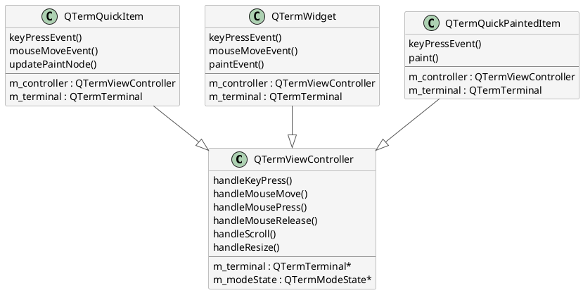

# 前端层：控制与渲染

本文讨论 `QTermViewController`、`QTermQuickItem`、`QTermWidget` 如何协作处理输入事件、
管理滚动和渲染终端显示。

---

## 整体设计：组合而非继承

QTerm 的前端采用**组合模式**。三个前端 Widget 类（QTermQuickItem、QTermQuickPaintedItem、QTermWidget）
都通过组合的 `QTermViewController` 来共享控制逻辑：



### 为什么不使用继承？

1. **多重渲染后端**：Qt Quick (Scene Graph)、Qt Quick Painted Items (QPainter)、QWidget (QPainter) 有不同的渲染生命周期
2. **单一职责**：ViewController 专注于输入/控制逻辑；Widget 专注于渲染细节
3. **代码复用**：三个前端共享相同的控制逻辑（按键编码、鼠标模式、滚动状态）

---

## QTermViewController：通用控制器

```cpp
class QTermViewController {
public:
    // 输入处理（由前端 Widget 调用）
    bool handleKeyPress(const QKeyEvent *event);
    bool handleMouseMove(const QMouseEvent *event, int row, int col);
    bool handleMousePress(const QMouseEvent *event, int row, int col);
    bool handleMouseRelease(const QMouseEvent *event, int row, int col);
    bool handleScroll(Qt::Orientation orient, int delta);
    void handleResize(int width, int height);  // 防抖后的尺寸

    // 属性访问
    QTermTerminal *terminal() const;
    QTermModeState *modeState() const;

private:
    QTermTerminal *m_terminal;
    QTermModeState *m_modeState;

    // 内部状态
    int m_lastMouseButton = Qt::NoButton;
    int m_lastMouseRow = 0, m_lastMouseCol = 0;
};
```

### 键盘事件处理流

```cpp
bool QTermViewController::handleKeyPress(const QKeyEvent *event) {
    // 1. 检查特殊键（Ctrl+C、Ctrl+Z 等）
    if (event->key() == Qt::Key_C && (event->modifiers() & Qt::ControlModifier)) {
        m_terminal->sendKey(QByteArray("\x03"));  // SIGINT
        return true;
    }

    // 2. 使用 QTermInputEncoder 将 Qt Key 转化为终端字节序列
    QTermInputEncoder encoder(m_modeState);
    QByteArray bytes = encoder.encodeKey(event);
    
    // 3. 发送到 Backend
    m_terminal->sendKey(bytes);
    return true;
}
```

### 鼠标事件处理流

```cpp
bool QTermViewController::handleMouseMove(const QMouseEvent *event, int row, int col) {
    if (!m_modeState->isMouseTrackingEnabled()) {
        // 鼠标追踪关闭：处理选择
        updateSelection(row, col);
        return true;
    }

    // SGR 1006 模式：发送协议化的鼠标数据包
    if (m_modeState->mouseProtocol() == SGR_1006) {
        QByteArray report = formatMouseReport(
            MouseButton::Move,
            row, col,
            event->modifiers()
        );
        m_terminal->sendKey(report);
        return true;
    }
    return false;
}

// 格式化鼠标报告（SGR 1006）：
// Motion：ESC [ <button> ; <col> ; <row> M
// Button 0 = left, 1 = middle, 2 = right, 3 = release, 64+ = wheel
```

---

## 鼠标协议与选择

### 鼠标追踪模式

当应用（vim、tmux、less）请求鼠标追踪时，ANSI 标准定义几种模式：

| Mode | Name | 说明 | CSI 序列 |
|------|------|------|---------|
| 1000 | 按钮 | 按下/释放 | `CSI ? 1000 h` |
| 1001 | 突出显示 | 按下+释放（用于选择）| `CSI ? 1001 h` |
| 1002 | 按钮事件 | 按下/释放/移动（当按钮按下）| `CSI ? 1002 h` |
| 1003 | 任何事件 | 所有移动（无需按钮）| `CSI ? 1003 h` |
| 1006 | SGR 扩展 | SGR 格式报告（现代）| `CSI ? 1006 h` |

### 选择 vs 鼠标协议

```
鼠标追踪关闭：
  单击、双击、三击 → 选择文本区域
  Shift+click → 扩展选择范围
  Ctrl+C 复制到剪贴板

鼠标追踪开启（Mode 1002）：
  所有鼠标事件 → 发送协议报告到 Backend
  应用（如 vim）处理报告，决定行为
  → 前端选择功能被禁用
  → 应用可实现自己的选择机制（例如 vim visual 模式）
```

### 选择模型（追踪关闭时）

```cpp
class QTermSelectionModel {
public:
    // 鼠标事件更新选择
    void singleClick(int row, int col);      // 清空，设置光标
    void doubleClick(int row, int col);      // 扩展到单词边界
    void tripleClick(int row, int col);      // 整行选择
    void shiftClick(int row, int col);       // 扩展选择到此点
    void updateSelection(int row, int col);  // 拖拽时连续更新

    // 查询
    bool hasSelection() const;
    QString selectedText() const;
    const QTermSelectionModel::Range &selectionRange() const;

signals:
    void copyRequested(const QString &text);  // 绑定到系统剪贴板
};
```

---

## 滚动与防抖

### 防抖机制

Resize 事件频繁到达（用户拖拽窗口边界）。频繁调用 `setTerminalSize()` 会导致：
1. Shell 收到多个 SIGWINCH
2. 应用重排显示，产生闪烁
3. 性能问题（reflow 计算昂贵）

QTerm 使用 **140ms 防抖定时器**：

```cpp
class QTermViewController {
private:
    void scheduleResize(int width, int height) {
        m_resizeTimer->stop();
        m_pendingWidth = width;
        m_pendingHeight = height;
        m_resizeTimer->start(140);  // 等待 140ms 无新 resize 事件
    }

    void onResizeTimerTimeout() {
        // 最后一次 resize 后无新事件，现在才真正执行 resize
        m_terminal->setTerminalSize(m_pendingWidth, m_pendingHeight, ...);
    }

    QTimer *m_resizeTimer = nullptr;
    int m_pendingWidth, m_pendingHeight;
};
```

### 滚动位置

Frontend 通过两个属性来控制滚动：

```cpp
// Qt Quick 版本
ScrollBar {
    position: terminal.scrollPosition       // 0.0 = 底部, 1.0 = 顶部
    size: terminal.scrollSize               // 可见区域占比 (0.0 ~ 1.0)
}

// QWidget 版本
scrollBar->setRange(0, terminal.maxScrollOffset);
scrollBar->setValue(terminal.scrollOffset);
```

### Qt Quick 双向绑定

```qml
QTermQuickItem {
    id: terminal
    // …
}

ScrollBar {
    id: scrollBar
    orientation: Qt.Vertical
    position: terminal.scrollPosition
    size: terminal.scrollSize

    Binding {
        target: scrollBar
        property: "position"
        value: terminal.scrollPosition
        when: !scrollBar.pressed  // 用户没有拖拽
    }

    Binding {
        target: terminal
        property: "scrollPosition"
        value: scrollBar.position
        when: scrollBar.pressed   // 用户拖拽时，把 ScrollBar 位置反馈给 Terminal
    }
}
```

### QWidget 事件连接

```cpp
void TerminalWindow::setupScrollBar() {
    connect(terminal, &QTermWidget::scrollOffsetChanged, 
            scrollBar, &QScrollBar::setValue);
    
    connect(scrollBar, QOverload<int>::of(&QScrollBar::valueChanged),
            [this](int value) {
        terminal->setScrollOffset(value);
    });
    
    connect(terminal, &QTermWidget::maxScrollOffsetChanged,
            [this](int maxOffset) {
        scrollBar->setMaximum(maxOffset);
    });
}
```

---

## 渲染后端

### QTermQuickItem：Scene Graph 渲染

Qt Quick 使用**Scene Graph**（硬件加速）。QTermQuickItem 是 QQuickItem 子类，
在 `updatePaintNode()` 中构建渲染指令：

```cpp
class QTermQuickItem : public QQuickItem {
protected:
    QSGNode *updatePaintNode(QSGNode *oldNode, UpdatePaintNodeData *data) override {
        // 1. 检查脏行（仅重绘修改过的行）
        const QVector<int> &dirtyRows = terminal()->dirtyRows();
        
        // 2. 为每个脏行构建纹理（glyph + 颜色）
        for (int row : dirtyRows) {
            updateRowTexture(row);
        }
        
        // 3. 构建或更新 QSGNode 树（几何体 + 纹理节点）
        QSGNode *root = new QSGTransformNode();
        // … 添加脏行的纹理节点 …
        
        // 4. 返回新 Node 树，Scene Graph 自动管理渲染
        return root;
    }

private:
    void updateRowTexture(int row) {
        // 获取该行 QTermLine（逻辑行文本 + 属性）
        const QTermLine &line = terminal()->line(row);
        
        // 将每个字符渲染为 glyph（使用字体缓存）
        // 应用颜色、背景、装饰（粗体、下划线等）
        // 生成行纹理
    }
};
```

### QTermWidget：QPainter 渲染

QWidget 使用 **QPainter**（软件渲染或 OpenGL 加速）。在 `paintEvent()` 中绘制：

```cpp
class QTermWidget : public QWidget {
protected:
    void paintEvent(QPaintEvent *event) override {
        QPainter painter(this);
        
        // 1. 遍历显示的行
        for (int row = 0; row < terminal()->rows(); ++row) {
            const QTermLine &line = terminal()->line(row);
            
            // 2. 绘制背景色
            painter.fillRect(
                0, row * fontHeight(),
                width(), fontHeight(),
                colorForAttributes(line.defaultAttributes())
            );
            
            // 3. 绘制文本和前景色
            for (int col = 0; col < line.length(); ++col) {
                const QTermCell &cell = line.cell(col);
                QColor fg = colorForAttributes(cell.attributes());
                painter.setPen(fg);
                painter.drawText(
                    col * fontWidth(), row * fontHeight(),
                    fontWidth(), fontHeight(),
                    Qt::AlignCenter,
                    QString(cell.character())
                );
            }
        }
        
        // 4. 绘制光标
        drawCursor(&painter);
        
        // 5. 绘制选择高亮
        drawSelection(&painter);
    }
};
```

### 渲染性能

| 后端 | 加速 | 适合场景 |
|------|------|---------|
| QTermQuickItem | 硬件（Scene Graph） | 现代应用；高帧率需求 |
| QTermQuickPaintedItem | 软件（单线程 QPainter） | 简单嵌入；轻量应用 |
| QTermWidget | 硬件或软件（取决于 QStyle） | 传统桌面应用；集成便利 |

---

## 光标与装饰

### 光标形状协商

应用可通过 ANSI 序列 DECSCUSR 请求光标形状：

```
CSI 1 SP q  →  block cursor (default)
CSI 2 SP q  →  block cursor (blinking)
CSI 3 SP q  →  underline cursor
CSI 4 SP q  →  underline cursor (blinking)
CSI 5 SP q  →  bar cursor
CSI 6 SP q  →  bar cursor (blinking)
```

Frontend 根据 `cursorShape` 属性调整渲染：

```cpp
void renderCursor(QPainter *painter) {
    QTermCursorState cursor = terminal()->cursorState();
    
    switch (cursor.shape()) {
    case QTermCursorShape::Block:
        painter->drawRect(cellRect(cursor.row(), cursor.col()));
        break;
    case QTermCursorShape::Underline:
        painter->drawLine(x, y + cellHeight() - 2, x + cellWidth(), y + cellHeight() - 2);
        break;
    case QTermCursorShape::Bar:
        painter->drawLine(x, y, x, y + cellHeight());
        break;
    }
}
```

### SGR 装饰：粗体、下划线、反向

```cpp
QColor effectiveColor = attributes.foregroundColor;

// 粗体：更亮的颜色或加粗字体
if (attributes.bold) {
    painter.setFont(boldFont);
    effectiveColor = effectiveColor.lighter(150);
}

// 下划线
if (attributes.underline) {
    painter.drawLine(x, y + fontHeight() - 2, x + fontWidth(), y + fontHeight() - 2);
}

// 反向（背景色 ↔ 前景色）
if (attributes.reverse) {
    std::swap(effectiveColor, backgroundColor);
}

// 淡化（减半亮度）
if (attributes.dim) {
    effectiveColor = effectiveColor.darker(150);
}

// 闪烁（可选实现：定时隐现）
if (attributes.blink) {
    if ((QTime::currentTime().msec() / 500) % 2 == 0) {
        effectiveColor = backgroundColor;  // 隐现效果
    }
}
```

---

## 事件生命周期示例

### 用户按 Ctrl+C

```
1. OS 发送 QKeyEvent (Key_C, ControlModifier) 到前端 Widget

2. QTermWidget::keyPressEvent(QKeyEvent *e)
   │
   ├─ m_controller->handleKeyPress(e)
   │
   └─ QTermViewController::handleKeyPress(QKeyEvent *e)
      │
      ├─ 检查：Key_C + Ctrl → SIGINT (0x03)
      │
      └─ m_terminal->sendKey(QByteArray("\x03"))
         │
         ├─ QTermTerminal::sendKey()
         │
         └─ QTermSession::write(data)
            │
            └─ Backend::writeData("\x03")
               │
               └─ PTY: write(fd, "\x03", 1)
                  │
                  → Shell 进程收到 SIGINT
                  → 前台应用捕获 SIGINT（如 vim、less）
```

### 用户点击终端（鼠标追踪关闭）

```
1. OS 发送 QMouseEvent (单击，位置=(x,y)) 到前端 Widget

2. QTermWidget::mousePressEvent(QMouseEvent *e)
   │
   ├─ 计算行/列：row = y / fontHeight, col = x / fontWidth
   │
   ├─ m_controller->handleMousePress(e, row, col)
   │
   └─ QTermViewController::handleMousePress()
      │
      ├─ 检查鼠标协议是否开启？
      │  ├─ 是 → 发送 SGR 报告给 Backend
      │  └─ 否 → 更新选择
      │
      └─ m_selectionModel->singleClick(row, col)
         │
         ├─ 清空旧选择
         ├─ 设置新锚点 (anchorRow, anchorCol) = (row, col)
         └─ emit selectionChanged()
            │
            → Frontend 重绘被选择的区域高亮
```

---

## 相关文档

- [overview.md](overview.md) — 前端层在五层架构中的定位
- [core.md](core.md) — Core 层如何处理控制命令
- [../guides/input-keymap.md](../guides/input-keymap.md) — 键盘编码规则
- [../guides/selection-clipboard.md](../guides/selection-clipboard.md) — 选择与剪贴板交互
