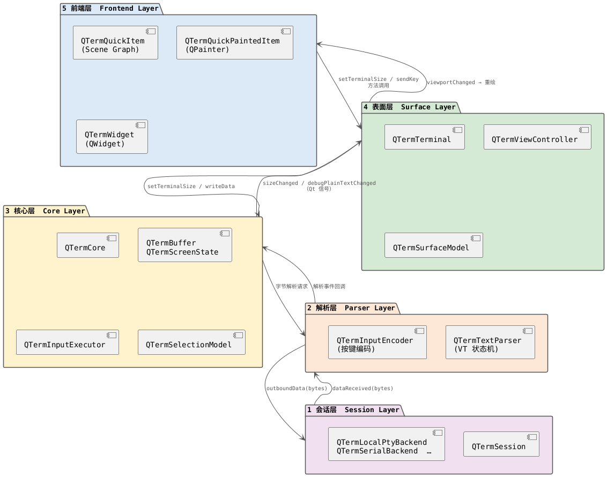

# 架构概览

QTerm 由五个独立的层组成。依赖方向单一：上层调用下层的方法；下层只通过信号向上通知。



---

## 各层职责

### 会话层（Session Layer）

负责持有外部字节流。每个后端实现四个虚方法：`open()`、`close()`、`writeData()`、`resize()`。

后端对终端序列一无所知，只负责移动原始字节，并暴露一个状态枚举
（`Closed → Opening → Open → Closing → Error`）。

`QTermSession` 是一个轻量的 QML 友好封装，持有 `QTermSessionBackend` 指针，
并以稳定的对象身份重新发射其信号。这样 QML 绑定可以在后端被赋值之前就挂载到会话上。

### 解析层（Parser Layer）

`QTermTextParser` 实现了 ECMA-48 / VT 状态机。它接收原始字节并为以下内容触发回调：

- 可打印字符与 UTF-8 码点
- C0 / C1 控制码
- CSI 序列（光标移动、SGR 样式、DECSTBM 滚动区域、鼠标协议……）
- OSC 序列（标题、超链接、剪贴板、shell 集成）
- DCS 和 APC 序列

`QTermInputEncoder` 方向相反：将 Qt 按键事件翻译为当前终端模式下正确的字节序列
（应用光标键模式、数字键盘模式、bracketed paste 等）。

### 核心层（Core Layer）

`QTermCore` 是整个库的语义核心，持有：

- 两个 `QTermScreenState` 对象——主屏和备用屏（alternate screen）。
- `QTermModeState`——所有 DEC 私有模式标志与 ANSI 模式。
- OSC 8 超链接注册表。

`QTermScreenState` 持有一个 `QTermBuffer` 以及当前滚动区域（`scrollTop`、`scrollBottom`）。
`QTermBuffer` 拥有实际的字符格网和累积的历史行。

`QTermInputExecutor` 位于解析器和核心模型之间，接收解析器事件并据此修改 `QTermCore`
（光标移动、字符写入、行操作、模式切换、切换备用屏等）。

`QTermSelectionModel` 跟踪当前选区范围，并可将其投影到可见行上供高亮渲染使用。

### 表面层（Surface Layer）

`QTermTerminal` 是主要的公开对象。它将 `QTermSession` 与 `QTermCore` 连接起来，
双向路由数据，并暴露稳定的 QML API：

| 属性 | 类型 | 说明 |
|------|------|------|
| `rows` / `columns` | int | 当前终端尺寸 |
| `scrollOffset` | int | 视口底部之上已滚动的行数 |
| `maxScrollOffset` | int | 可供滚动的历史行总数 |
| `session` | QTermSession* | 可写；运行时可随时替换 |
| `title` | QString | 由 OSC 0 / OSC 2 更新 |
| `surfaceModel` | QTermSurfaceModel* | 供渲染层使用的只读快照 |

`QTermSurfaceModel` 产生不可变的视口快照。渲染层只读取，从不写入。
这种解耦意味着 Core 可以在任意线程更新，而渲染层始终操作稳定的快照。

`QTermViewController` 是一个共享的控制 `QObject`，被组合进每个前端控件，负责：

- 将 `QTermTerminal` 绑定到前端 item
- 字符格尺寸追踪与终端 resize 防抖（140 ms）
- 鼠标事件解释（按钮追踪、连击选词/选逻辑行）
- 滚动位置管理，暴露 `scrollPosition` / `scrollSize` QML 属性
- 发出 `copyRequested` 和 `hyperlinkActivated` 信号

### 前端层（Frontend Layer）

每个前端控件只继承其 Qt 基类，通过组合方式持有一个 `QTermViewController`：

| 类 | Qt 基类 | 渲染方式 |
|----|---------|----------|
| `QTermQuickPaintedItem` | `QQuickPaintedItem` | `QPainter`，通过 `paint()` |
| `QTermQuickItem` | `QQuickItem` | Qt Scene Graph，通过 `updatePaintNode()` |
| `QTermWidget` | `QWidget` | `QPainter`，通过 `paintEvent()` |

三者均响应相同的 `QTermTerminal` 属性。切换前端不需要修改会话或核心配置。

---

## 数据流

### 入站（远端 → 屏幕）

```
Backend::dataReceived(bytes)
  └─→ QTermSession::dataReceived(bytes)
        └─→ QTermTerminal（解码 UTF-8，交给 QTermCore）
              └─→ QTermTextParser（状态机）
                    └─→ QTermInputExecutor（修改 QTermCore 状态）
                          └─→ QTermCore::debugPlainTextChanged / sizeChanged / …
                                └─→ QTermTerminal::viewportChanged
                                      └─→ QTermViewController → 重绘
```

### 出站（按键 → 后端）

```
前端按键事件
  └─→ QTermViewController::handleKeyPress
        └─→ QTermTerminal::sendKey
              └─→ QTermCore::encodeKey / QTermInputEncoder
                    └─→ QTermCore::outboundData(bytes)
                          └─→ QTermTerminal
                                └─→ QTermSession::writeData(bytes)
                                      └─→ Backend::writeData(bytes)
```

### Resize

```
前端几何变化
  └─→ QTermViewController（防抖 140 ms）
        └─→ QTermTerminal::setTerminalSize(cols, rows)
              └─→ QTermCore::setTerminalSize
                    └─→ QTermScreenState::resize（历史行重排）
              └─→ QTermSession::resize(cols, rows)
                    └─→ Backend::resize → TIOCSWINSZ
```

---

## 关键设计决策

**Headless-first。** `QTermCore` 和 `QTermTextParser` 对 GUI 类型没有任何依赖。所有单元测试均在无 QQuickItem 或 QWidget 的情况下覆盖核心行为。

**Transport-agnostic。** `QTermCore` 从不接触文件描述符或套接字，只接收 `QByteArray`，只发送 `QByteArray`。

**逻辑行语义。** `QTermBuffer` 保存在视口宽度变化后仍然有效的逻辑行。物理行是当前宽度下的投影，不是规范内容模型。详见 [surface.md](surface.md)。

**渲染层只读。** `QTermSurfaceModel` 向渲染层提供只读视图，没有任何渲染器回写 Buffer。

**组合优于继承。** `QTermViewController` 是一个普通 `QObject`，通过组合嵌入前端控件，避免了跨越不兼容的 `QQuickItem` / `QWidget` 基类层次结构所带来的菱形继承问题。
