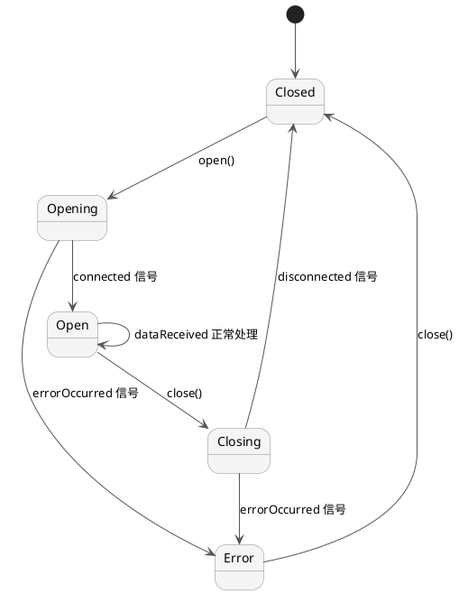

# 会话层：Backend 与数据流

本文讨论 `QTermSession` 和 `QTermSessionBackend` 如何连接外界输入/输出与 QTermCore。

---

## 会话生命周期

所有 Backend 都遵循相同的状态机：



### 状态枚举

```cpp
enum class QTermSessionBackend::State {
    Closed = 0,      // 未连接，init 状态
    Opening = 1,     // open() 已调用，等待连接
    Open = 2,        // 连接成功，收发正常
    Closing = 3,     // close() 已调用，等待断开
    Error = 4        // 发生错误（详见 errorOccurred 信号数据）
};
```

### 状态转移规则

| 当前 | 事件 | 目标 | 行为 |
|------|------|------|------|
| Closed | open() | Opening | 启动异步连接 |
| Opening | connected() | Open | 连接成功，恢复收发 |
| Opening | error() | Error | 连接失败，保存错误信息 |
| Open | close() | Closing | 启动关闭序列 |
| Open | error() | Error | 运行时错误（崩溃、断网） |
| Closing | disconnected() | Closed | 完成关闭 |
| Closing | error() | Error | 关闭过程出错 |
| Error | close() | Closed | 重置为初始状态 |

---

## QTermSessionBackend：抽象接口

所有 Backend 继承此抽象类：

```cpp
class QTermSessionBackend : public QObject {
public:
    // 状态查询
    State state() const;

    // 控制操作
    virtual void open() = 0;                  // 建立连接
    virtual void close() = 0;                 // 断开连接
    virtual void writeData(const QByteArray &data) = 0;  // 发送数据

    // 后端特定操作（默认无操作）
    virtual void setTerminalSize(int rows, int columns, int pixelWidth, int pixelHeight) {
        // Terminal 告诉后端屏幕尺寸（用于 TIOCSWINSZ 等）
        // 默认无操作；Serial 等无屏幕概念的 Backend 可忽略
    }

signals:
    // 连接生命周期
    void stateChanged(State newState);
    void connected();                // state 从 Opening → Open
    void disconnected();             // state 从 Closing → Closed
    void errorOccurred(const QString &error);  // state → Error

    // 数据事件
    void dataReceived(const QByteArray &data);  // Backend 接收到数据
};
```

---

## QTermSession：包装层

`QTermSession` 包装 Backend，提供稳定身份和连接管理：

```cpp
class QTermSession : public QObject {
public:
    // Backend 管理
    void setBackend(QTermSessionBackend *backend);
    QTermSessionBackend *backend() const;

    // 状态转发
    QTermSessionBackend::State state() const;

    // 便利方法
    bool isOpen() const { return state() == QTermSessionBackend::State::Open; }
    void open() { backend()->open(); }
    void close() { backend()->close(); }
    void write(const QByteArray &data) { backend()->writeData(data); }

    // 屏幕尺寸转发
    void setTerminalSize(int rows, int columns, int pixelWidth, int pixelHeight);

signals:
    // Backend 信号的转发（不直接来自 Backend 指针，而是 Session 自己发出）
    void stateChanged(QTermSessionBackend::State newState);
    void connected();
    void disconnected();
    void errorOccurred(const QString &error);
    void dataReceived(const QByteArray &data);

private slots:
    void onBackendStateChanged(QTermSessionBackend::State state);
    void onBackendDataReceived(const QByteArray &data);
    void onBackendErrorOccurred(const QString &error);
    // …
};
```

### 为什么需要包装？

1. **身份稳定性**：Frontend 持有 `QTermSession*` 指针。即使替换底层 Backend 对象，Session 指针不变。
2. **生命周期管理**：Session 负责连接/断开 Backend 信号，防止悬空指针。
3. **多 Backend 切换**：运行时从 PTY 切换到 Serial，Session 负责旧 Backend 的清理和新 Backend 的设置。

---

## 内置 Backend：QTermLocalPtyBackend

### 设计原则

PTY（伪终端）是 Unix 系统上实现本地 shell 的标准接口。QTermLocalPtyBackend 使用 fork/exec 来启动子进程。

### 属性设置

```cpp
backend = new QTermLocalPtyBackend();
backend->setProgram("/bin/bash");           // shell 可执行文件
backend->setArguments({"-i", "-l"});        // 交互式登录 shell
backend->setWorkingDirectory("/home/user"); // 工作目录
backend->setProcessEnvironment(env);        // 环境变量
// … 然后设置到 Session
session.setBackend(backend);
session.open();
```

### 内部流程

```
1. open() 被调用
   ↓
2. fork() → 创建子进程
   ├─ 父进程：保持运行
   └─ 子进程：execve(program, args, env)
   ↓
3. grantpt() + unlockpt() + tcgetattr()
   ↓
4. connected() 信号发出，state → Open
   ↓
5. Qt EventLoop 监听 PTY fd，读取 dataReceived
   ↓
6. 用户写入：writeData(data) → write(ptyfd, data)
   ↓
7. Resize：setTerminalSize(rows, cols) → ioctl(ptyfd, TIOCSWINSZ, &size)
          → shell 收到 SIGWINCH
```

### 关键参数

| 属性 | 说明 | 示例 |
|------|------|------|
| `program` | 启动的可执行文件 | "/bin/bash", "/bin/zsh" |
| `arguments` | 命令行参数 | {"-i", "-l"} 表示交互式登录 |
| `workingDirectory` | 初始工作目录 | "/home/user" |
| `processEnvironment` | 环境变量传递 | QProcessEnvironment 对象 |

---

## 内置 Backend：QTermSerialBackend

### 设计原则

串行端口（Serial Port）用于连接物理设备（工业设备、网络设备管理卡等）。
QTermSerialBackend 使用 Qt 的 QSerialPort 封装平台特定 API。

### 属性设置

```cpp
backend = new QTermSerialBackend();
backend->setPort("/dev/ttyUSB0");           // 或 COM3（Windows）
backend->setBaudRate(9600);                 // 波特率
backend->setDataBits(QSerialPort::Data8);   // 8 数据位
backend->setParity(QSerialPort::NoParity);  // 无校验
backend->setStopBits(QSerialPort::OneStop); // 1 停止位
backend->setFlowControl(QSerialPort::NoFlowControl);  // 无流控
session.setBackend(backend);
session.open();
```

### 标准配置预置

| 场景 | 配置 |
|------|------|
| RS-232 设备管理 | 9600, 8N1, 无流控 |
| 现代 TTY 设备 | 115200, 8N1, RTS/CTS |
| Hayes 调制解调器 | 2400, 8N1, Xon/Xoff |

### 关键参数

| 属性 | 说明 | 取值 |
|------|------|------|
| `port` | 设备路径 | "/dev/ttyUSB0", "COM3" |
| `baudRate` | 波特率 | 300–921600 (OS 支持的范围) |
| `dataBits` | 数据位 | 5/6/7/8 |
| `parity` | 奇偶校验 | None/Even/Odd/Mark/Space |
| `stopBits` | 停止位 | 1/1.5/2 |
| `flowControl` | 流控制 | None/HardwareControl/SoftwareControl |

### Resize 行为

Serial Backend 不支持 `setTerminalSize()`——物理设备不参与屏幕协议。
调用该方法时，Backend 默认无操作。终端尺寸由前端 UI 决定。

---

## 内置 Backend：QTermTelnetBackend

### 设计原则

Telnet（RFC 854）是明文网络终端协议。用于远程主机连接。
QTermTelnetBackend 基于 QTcpSocket，并实现选项协商（RFC 1073 NAWS、RFC 857/858）。

### 属性设置

```cpp
backend = new QTermTelnetBackend();
backend->setHost("192.168.1.10");  // 目标主机
backend->setPort(23);               // Telnet 端口（通常 23；也可用 SSH 2222 等）
session.setBackend(backend);
session.open();
```

### Telnet 协商

Telnet 使用 **IAC（Interpret As Command）** 字节 (0xFF) 启动协商：

```
IAC DO NAWS          → 请求客户端通知窗口大小
IAC SB NAWS <rows> <cols> IAC SE  → 客户端响应尺寸
IAC WILL ECHO        → 服务器声明将回显
IAC DO SGA           → 请求客户端抑制前进/退格
```

QTermTelnetBackend 在 `setTerminalSize()` 被调用时自动发送 NAWS 协商：

```cpp
void QTermTelnetBackend::setTerminalSize(int rows, int cols, int, int) {
    QByteArray naws;
    naws += (char)0xFF;  // IAC
    naws += (char)0xFA;  // SB (子协商开始)
    naws += (char)0x1F;  // NAWS (窗口大小)
    naws += (char)rows;
    naws += (char)cols;
    naws += (char)0xFF;  // IAC
    naws += (char)0xF0;  // SE (子协商结束)
    socket->write(naws);
}
```

### 关键参数

| 属性 | 说明 | 示例 |
|------|------|------|
| `host` | 目标主机名或 IP | "192.168.1.10", "example.com" |
| `port` | 目标端口 | 23 (Telnet), 2222 (SSH over Telnet) |

---

## 自定义 Backend：扩展机制

若要支持其他传输方式（如 SSH、WebSocket、USB serial 等），继承 `QTermSessionBackend`：

```cpp
class MyCustomBackend : public QTermSessionBackend {
public:
    void open() override {
        // 1. 启动异步连接
        QTimer::singleShot(0, this, [this]() {
            if (doConnect()) {
                setState(State::Open);
                emit connected();
            } else {
                setState(State::Error);
                emit errorOccurred("Connection failed");
            }
        });
    }

    void close() override {
        // 2. 清理资源
        if (m_socket) {
            m_socket->disconnectFromHost();
        }
        setState(State::Closed);
        emit disconnected();
    }

    void writeData(const QByteArray &data) override {
        // 3. 将数据发送到目标
        if (isOpen()) {
            m_socket->write(data);
        }
    }

    void setTerminalSize(int rows, int columns, int, int) override {
        // 4. 可选：通知目标尺寸变化（如需要）
        sendWindowSizeProposal(rows, columns);
    }

private:
    void setState(State state) {
        m_state = state;
        emit stateChanged(state);
    }

    bool doConnect() {
        // 实现自定义连接逻辑
        m_socket = new QTcpSocket(this);
        connect(m_socket, &QTcpSocket::readyRead, this, [this]() {
            emit dataReceived(m_socket->readAll());
        });
        m_socket->connectToHost(m_host, m_port);
        return m_socket->waitForConnected(3000);
    }

    QTcpSocket *m_socket = nullptr;
    State m_state = State::Closed;
    QString m_host;
    int m_port;
};

// 使用
MyCustomBackend *backend = new MyCustomBackend();
session.setBackend(backend);
session.open();
```

### 检查清单

- [ ] 继承 `QTermSessionBackend`
- [ ] 实现 `open()`, `close()`, `writeData()`
- [ ] 在连接成功时调用 `setState(Open)` 和 `emit connected()`
- [ ] 在发生错误时调用 `setState(Error)` 和 `emit errorOccurred(msg)`
- [ ] 在断开连接时调用 `setState(Closed)` 和 `emit disconnected()`
- [ ] 每收到数据都 `emit dataReceived(data)`
- [ ] 可选：实现 `setTerminalSize()` 用于窗口大小协商
- [ ] 测试生命周期：open → connected → dataReceived → ... → close → disconnected

---

## 数据流链

### 入站（从 Backend 到 Core）

```
Backend.dataReceived(bytes)
  ↓ (QTermSession 转发)
QTermSession.dataReceived(bytes)
  ↓ (QTermTerminal 连接)
QTermTerminal.writePlainText(bytes)
  ↓ (UTF-8 解码)
QTermCore.writeData(text)
  ↓ (Parser → Executor)
QTermScreenState 更新
  ↓
Frontend.onDebugPlainTextChanged()
  ↓
渲染更新
```

### 出站（从 Frontend 到 Backend）

```
Frontend.keyPressEvent(key)
  ↓
QTermViewController.handleKeyPress(key)
  ↓
QTermTerminal.sendKey(data)
  ↓
QTermSession.write(data)
  ↓
Backend.writeData(data)
  ↓
传输到目标（PTY write、Serial write 等）
```

### 尺寸变化流

```
Frontend.resizeEvent(width, height)
  ↓ (140ms 防抖)
QTermCore.setTerminalSize(rows, cols, pixelW, pixelH)
  ↓ (通知 Buffer reflow)
QTermBuffer.resize(cols)
  ↓ (通知 Session 及其 Backend)
QTermSession.setTerminalSize(rows, cols, pixelW, pixelH)
  ↓
Backend.setTerminalSize(rows, cols, pixelW, pixelH)
  ↓
传输目标收到尺寸更新（TIOCSWINSZ、NAWS 等）
  ↓
Shell 收到 SIGWINCH，调整输出格式
```

---

## 运行时 Backend 切换

在同一个 QTermSession 中替换 Backend（例如从 Local PTY 切换到 SSH）：

```cpp
// 正在使用 Local PTY
QTermLocalPtyBackend *ptyBackend = new QTermLocalPtyBackend();
ptyBackend->setProgram("/bin/bash");
session.setBackend(ptyBackend);
session.open();
// … 运行中 …

// 切换到 Telnet
session.close();  // 断开旧 Backend
// … 等待 disconnected() 信号 …

QTermTelnetBackend *telnetBackend = new QTermTelnetBackend();
telnetBackend->setHost("example.com");
telnetBackend->setPort(23);
session.setBackend(telnetBackend);
session.open();
```

### 关键点

1. **总是先 `close()` 当前 Backend**——确保旧连接正确清理
2. **等待 `disconnected()` 信号**——某些 Backend 可能需要异步清理
3. **然后 `setBackend()` 新 Backend**——Session 会自动连接信号
4. **再调用 `open()`**

---

## 相关文档

- [core.md](core.md) — QTermCore 如何处理接收到的数据
- [overview.md](overview.md) — Session 层在五层架构中的定位
- [../guides/session-backends.md](../guides/session-backends.md) — Backend 配置参考
