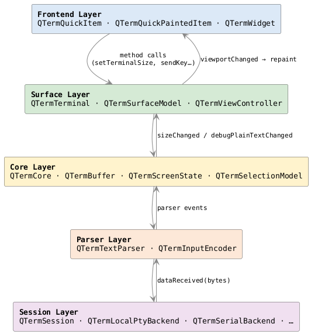

# QTerm 概览

QTerm 是一个面向 Qt 生态的**终端模拟器组件库**。它不是单一控件，而是一套分层的终端能力栈：从底层的字节传输、协议解析、屏幕状态管理，到上层的 Qt Quick 和 QWidget 渲染前端，每一层都可以独立使用和测试。

---

## 核心定位

| | QTerm |
|---|---|
| 协议实现 | 自主实现，Qt only |
| 前端方案 | Qt Quick / QWidget |
| 历史记录 | 逻辑行重排，resize 后正确恢复 | 
| 可测试性 | 核心无 GUI 依赖，headless 可测 |

---

## 五层架构

数据只向上流动（信号驱动）；命令只向下发送（方法调用）。渲染层从不直接修改 Core。

详细架构说明见 [architecture/overview.md](../architecture/overview.md)。

---

## 主要公开类型

| 类 | 说明 |
|----|------|
| `QTermTerminal` | 高层门面对象，连接 Session 与 Core，暴露 QML 属性 |
| `QTermSession` | 会话封装，持有一个 `QTermSessionBackend` |
| `QTermLocalPtyBackend` | 本地 PTY 后端（Unix / macOS / Linux） |
| `QTermSerialBackend` | 串口后端 |
| `QTermSurfaceModel` | 视口只读快照，供渲染层消费 |
| `QTermQuickItem` | Qt Quick 渲染前端（Scene Graph） |
| `QTermQuickPaintedItem` | Qt Quick 渲染前端（QPainter，兼容性更好） |

---

## 设计原则

**Headless-first**  
`QTermCore` 和 `QTermTextParser` 没有任何 GUI 依赖。所有核心行为都可以在单元测试中覆盖，不需要显示窗口。

**Transport-agnostic**  
Core 只看 `QByteArray`，不知道底层是 PTY、串口还是 SSH。切换后端不影响协议处理逻辑。

**逻辑行语义**  
`QTermBuffer` 保存逻辑行（logical lines），而不是当前宽度下的物理行（physical rows）。resize 时，历史内容会按新宽度正确重排，不会出现内容截断或空行残留。

**渲染层只读**  
`QTermSurfaceModel` 提供不可变的视口快照。渲染层读取快照，但不回写 Buffer 状态。

---

## 快速开始

- [CMake 集成](cmake-integration.md) — 将 QTerm 加入你的项目
- [第一个终端（Qt Quick）](first-terminal.md) — 30 行 QML 启动一个本地 shell
- [第一个终端（QWidget）](first-terminal-widget.md) — 纯 C++ 路径，无 QML 依赖
