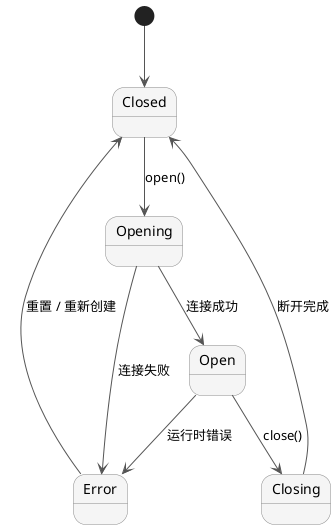

# 会话后端

QTerm 使用 `QTermSessionBackend` 抽象一切字节传输。核心层只看 `QByteArray`，
与底层是 PTY、串口还是网络连接无关。

---

## 状态机

所有后端共享同一个状态枚举，定义在 `QTermSessionBackend::State`：



| 状态 | 枚举值 | 说明 |
|------|--------|------|
| `Closed` | 0 | 初始状态；`open()` 之前或关闭完成后 |
| `Opening` | 1 | `open()` 已调用，正在建立连接 |
| `Open` | 2 | 连接就绪，可以收发数据 |
| `Closing` | 3 | `close()` 已调用，正在断开 |
| `Error` | 4 | 发生不可恢复错误；`errorOccurred` 信号已发出 |

`QTermSession` 将后端的 `stateChanged` 信号透传出去，QML 可以直接绑定：

```qml
Text {
    text: switch (session.state) {
        case 0: return "未连接"
        case 2: return "已连接"
        case 4: return "错误"
        default: return "连接中…"
    }
}
```

---

## QTermLocalPtyBackend — 本地 PTY

Unix / macOS / Linux 平台的本地 shell 会话。使用 `posix_openpt` 打开伪终端主设备，
`fork` 后在子进程中执行指定程序。

### 属性

| 属性 | 类型 | 默认值 | 说明 |
|------|------|--------|------|
| `program` | QString | `""` | 要执行的程序路径；空字符串时自动取 `$SHELL`，再退到 `/bin/sh` |
| `arguments` | QStringList | `[]` | 传给程序的参数列表 |
| `workingDirectory` | QString | `""` | 工作目录；空字符串时使用当前进程目录 |

进程环境变量通过 `setProcessEnvironment()` 设置（C++ API，QML 不直接暴露），
默认继承当前进程的完整环境并追加 `TERM=xterm-256color`。

### 用法示例

```qml
QTermLocalPtyBackend {
    id: pty
    program: "/bin/bash"
    arguments: ["--login"]
    workingDirectory: "/home/user"
}
```

```cpp
// C++ 用法
auto *pty = new QTerm::QTermLocalPtyBackend(this);
pty->setProgram("/bin/bash");
pty->setArguments({"--login"});
pty->setProcessEnvironment(QProcessEnvironment::systemEnvironment());
```

### 注意事项

- `resize()` 通过 `TIOCSWINSZ ioctl` 通知子进程，会触发 `SIGWINCH`。
- 子进程退出后，后端自动转到 `Closed` 状态并发出 `stateChanged`。
- Windows 平台暂不支持（ConPTY 后端待实现）。

---

## QTermSerialBackend — 串口

基于 Qt Serial Port 的串口连接，常用于嵌入式设备调试控制台。

### 属性

| 属性 | 类型 | 默认值 | 说明 |
|------|------|--------|------|
| `portName` | QString | `""` | 串口名称，如 `/dev/tty.usbserial-0001`（macOS）、`COM3`（Windows） |
| `baudRate` | int | 115200 | 波特率；支持标准值（9600 / 38400 / 115200 / 230400 等） |
| `dataBits` | int | 8 | 数据位：5 / 6 / 7 / 8 |
| `parity` | QString | `"N"` | 校验位：`"N"`（无）/ `"E"`（偶）/ `"O"`（奇）/ `"M"` / `"S"` |
| `stopBits` | int | 1 | 停止位：1 / 2 |
| `flowControl` | QString | `"none"` | 流控：`"none"` / `"hardware"` / `"software"` |

### 用法示例

```qml
QTermSerialBackend {
    id: serial
    portName: "/dev/tty.usbserial-0001"
    baudRate: 115200
    dataBits: 8
    parity: "N"
    stopBits: 1
    flowControl: "none"
}
```

### 注意事项

- `resize()` 对串口无意义，调用后被忽略。
- 串口设备通常不支持终端协议，`TERM` 环境变量无法通过 PTY 传递；需要在设备上手动设置。
- 扫描可用串口可以用 `QTermSerialPortScanner`（C++ API）。

---

## QTermTelnetBackend — Telnet

基于 `QTcpSocket` 的 Telnet 后端，实现了 RFC 854 的基本协议及以下选项：

| RFC | 选项 | 说明 |
|-----|------|------|
| RFC 1073 | NAWS | 连接时及 `resize()` 时向服务端发送终端尺寸 |
| RFC 857 | ECHO | 请求服务端回显输入（交互式会话标准行为） |
| RFC 858 | SGA | 请求服务端关闭 Go-Ahead（全双工模式） |

未知的 `DO` / `WILL` 请求会自动以 `WONT` / `DONT` 拒绝。

### 属性

| 属性 | 类型 | 默认值 | 说明 |
|------|------|--------|------|
| `host` | QString | `""` | 服务器主机名或 IP 地址 |
| `port` | quint16 | 23 | TCP 端口；标准 Telnet 为 23 |

### 用法示例

```qml
QTermTelnetBackend {
    id: telnet
    host: "192.168.1.1"
    port: 23
}
```

### 注意事项

- Telnet 明文传输，不适用于互联网环境；生产环境请使用 SSH（SSH 后端待实现）。
- `resize()` 发送 `IAC SB NAWS` 子协商，告知服务端新尺寸。

---

## 实现自定义后端

继承 `QTermSessionBackend` 并实现四个纯虚方法：

```cpp
class MyBackend : public QTerm::QTermSessionBackend
{
    Q_OBJECT
public:
    void open() override {
        // 建立连接
        // 成功后调用 setState(Open)
        // 失败后调用 setState(Error) + emitErrorOccurred(msg)
    }

    void close() override {
        setState(Closing);
        // 断开连接
        setState(Closed);
    }

    void writeData(const QByteArray &data) override {
        // 将 data 发送到远端
    }

    void resize(int columns, int rows) override {
        // 可选：通知远端新的终端尺寸
        // 不支持时留空即可
    }

    // 收到数据时调用：
    // emitDataReceived(data);
};
```

**最小实现检查清单：**

- [ ] `open()` 成功后必须调用 `setState(Open)`，否则 `QTermSession` 不会发出 `stateChanged`
- [ ] 收到字节时必须调用 `emitDataReceived(data)`，Core 才能看到数据
- [ ] `close()` 中必须最终调用 `setState(Closed)`
- [ ] 运行时错误调用 `setState(Error)` + `emitErrorOccurred(message)`
